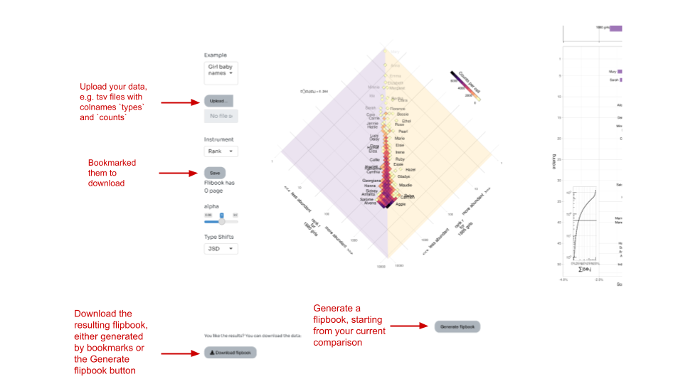

# zipfJuxtaposer

An allotaxonometer package, this shiny allows you to compare two zipfian ranked lists of components. This app provide the possibility to upload data (`.tsv` files with a columns named `types` and `counts`), and download the resulting flipbook. 


Note that the worshift part of the package comes from the `R` package [shifterator](https://github.com/pverspeelt/shifterator/), which is derived from the [Python package](https://github.com/ryanjgallagher/shifterator) of the same name. 

## Usage

You can use this app either locally or online. Locally, you first need to install the app:

``` r
devtools::install_github("jstonge/zipfjuxtaposer")
```
then you can run the shiny app as follows,

```r
library(zipfJuxtaposer)
run_app()
```

The only downside, if this is really one, is that this option requires you to download `R`. 

If using `R` is an issue, the app is deployed at this address: https://jsto.shinyapps.io/zipfJuxtaposer/. Although this option requires no `R` installation, the app is limited by the free shinyapp server that I am using. In particular, the app use caching to make it go faster. By trading off memory for speed, we rapidly hit the memory limits of the shinyapp server (1Go). This problem causes the shiny to freeze while using it (e.g. it tries to update its states without success). For this reason, **avoid producing large flipbook automatically as this is very memory-consuming**. If the app is found to be useful, it is possible to increase memory limits so that the online version is more useful. 

You can upload your data and download the flipbook via the following buttons.



Note that there are two ways to generate a flipbook, either you bookmarked a particular comparison via the `save` button, or you generate a flipbook automatically via the `generate flipbook` button. The later option will start from your current comparison, then iterate through the remaining indices. For instance, say you're comparing Boy babynames between 1990 and 2000. Hitting `generate flipbook` will produce the remaining pairs starting from 1990, that is, the pairs [1990-2000 1995-2005 2000-2010 2005-2015].
